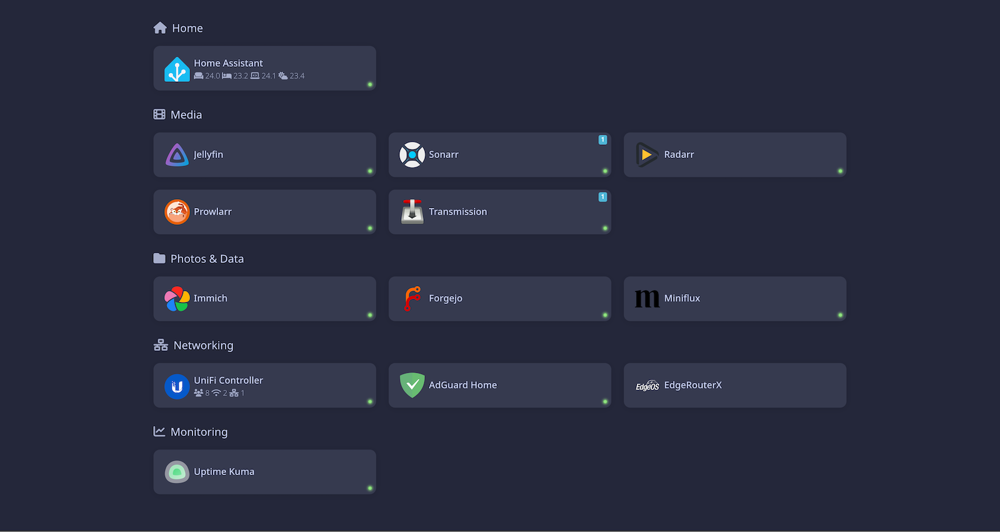

# Bart

A small, self-hosted homepage/dashboard for your home server, written in Go. It renders a static grid of links to your services and enriches each tile with **live data** pulled directly from the services' APIs — unread counts, download queues, now-playing sessions, sensor readings, container status, and more.

It is a single binary with no external runtime dependencies. Templates, styles, and fonts are embedded, so deployment is "copy the binary (or run the container) and point it at a config file".



## Why Bart exists

Bart is a successor to [Homer](https://github.com/bastienwirtz/homer), built for my own setup.

I ran Homer happily for a long time, but over time I kept needing things it didn't do, and ended up maintaining an ever-growing fork:

- **Backend API calls without a CORS proxy.** Homer is a static SPA, so any service that doesn't send permissive CORS headers needs a separate proxy in front of it (or a browser that ignores CORS). I had patched in a proxy server to work around this. Bart sidesteps the whole problem: the **server** makes the API calls, so there is no CORS to fight and **API keys never reach the browser**.
- **Docker container status.** I wanted a small "is this container running?" indicator on each tile. Bart talks to the Docker socket directly and shows a status dot.
- **Services displayed the way I want.** I had a pile of custom tweaks to how individual services render their live data. Rewriting those as small Go functions is far easier to maintain than carrying patches on top of upstream Homer.

At some point maintaining a divergent fork of a Vue/SPA app — rebasing on every upstream change, keeping a Node toolchain around — became more work than it was worth. A focused Go rewrite that does exactly what I need turned out to be the better idea. The visual design intentionally matches Homer's minimal Catppuccin theme, so it looks familiar.

Bart is opinionated and tailored to my needs. You're welcome to use it, but it is not trying to be a general-purpose, infinitely-configurable Homer replacement.

## Features

- **Single static binary** — templates, CSS, and fonts are embedded with `go:embed`. No Node, no build step at runtime.
- **Server-side data fetching** — no CORS proxy required, and secrets stay on the server.
- **Live tiles via HTMX** — tiles refresh themselves on an interval without a full-page SPA.
- **Docker status dots** — green/red/grey indicator per tile, read straight from the Docker socket.
- **Config hot-reload** — edit `config.yml` and changes are picked up within a couple of seconds, no restart needed. A broken edit is logged and ignored, keeping the last good config live.
- **System stats bar** — live CPU usage, free RAM, and free disk space displayed at the top of the page (Linux/Docker only).
- **Weather widget** — current conditions and temperature via OpenWeatherMap, shown top-right alongside the stats bar.
- **Built-in integrations** — Home Assistant, Sonarr/Radarr/Prowlarr, Jellyfin, Miniflux, Transmission, Uptime Kuma, UniFi.
- **Plain links for everything else** — any service can be a simple icon + link with no integration.

## Running it

### Docker (recommended)

```yaml
services:
  bart:
    build:
      context: ./bart            # directory containing the bart source
    container_name: bart
    volumes:
      - ./bart:/data:ro          # directory mount so hot-reload sees file changes
      - /var/run/docker.sock:/var/run/docker.sock:ro   # for container status
    entrypoint: ["/bart", "-config", "/data/config.yml", "-assets", "/data/assets"]
    ports:
      - 3000:8080
    restart: unless-stopped
```

```sh
docker compose up -d --build bart
```

> **Note on hot-reload:** mount the *directory* that contains `config.yml`, not the single file. Docker pins single-file bind mounts to an inode, so editors and tools that replace the file (e.g. `sed -i`, most editors saving with a temp file + rename) would not be visible to the container without a restart. A directory mount avoids this.

### From source

```sh
go build -o bart .
./bart -config config.yml -assets ./assets -addr :8080
```

Then open <http://localhost:8080>.

### Flags

| Flag      | Default            | Description                                  |
| --------- | ------------------ | -------------------------------------------- |
| `-config` | `config.yml`       | Path to the config file                      |
| `-addr`   | `:8080`            | Listen address                               |
| `-assets` | `./assets`         | Directory served at `/assets/` (logos, etc.) |

## Configuration

Configuration is a single YAML file. Top-level keys:

| Key            | Description                                                        |
| -------------- | ----------------------------------------------------------------- |
| `title`        | Page title (browser tab).                                          |
| `columns`      | Number of columns in the grid (default `3`).                       |
| `dockerSocket` | Path to the Docker socket (default `/var/run/docker.sock`).        |
| `sysInfo`      | System stats bar config (see below).                               |
| `weather`      | Weather widget config (see below).                                 |
| `services`     | List of groups; each group has a `name`, `icon`, and `items`.      |

A minimal example:

```yaml
title: "Home Lab"
columns: 3
dockerSocket: /var/run/docker.sock

sysInfo:
  enabled: true
  disk: "/"

weather:
  enabled: true
  apiKey: "your_owm_api_key"
  latitude: 50.09
  longitude: 14.50
  units: metric

services:
  - name: Media
    icon: "fas fa-film"
    items:
      - name: Jellyfin
        logo: "assets/icons/jellyfin.png"
        url: "https://jellyfin.example.com"
        apiUrl: "http://192.168.1.10:8096"
        type: jellyfin
        apikey: "xxxxxxxxxxxxxxxx"
        container: jellyfin
        updateIntervalMs: 30000
```

### System stats bar

Shows CPU usage, free RAM, and free disk space in a bar at the top-left of the page. Reads `/proc/stat` and `/proc/meminfo`; disk is measured with `statfs`. Designed for Linux — does nothing on macOS or Windows.

```yaml
sysInfo:
  enabled: true
  disk: "/"          # mount point to measure (default "/")
```

### Weather widget

Shows current conditions and temperature top-right, next to the stats bar. Fetches from [OpenWeatherMap](https://openweathermap.org/) every 15 minutes and caches the result. A free API key is sufficient.

```yaml
weather:
  enabled: true
  apiKey: "your_owm_api_key"
  latitude: 50.09
  longitude: 14.50
  units: metric      # metric (°C), imperial (°F), or standard (K) — default metric
```

### Item fields

| Field              | Applies to        | Description                                                                                  |
| ------------------ | ----------------- | -------------------------------------------------------------------------------------------- |
| `name`             | all               | Tile title.                                                                                  |
| `url`              | all               | Where the tile links to (opened in the **browser**).                                         |
| `apiUrl`           | integrations      | Base URL the **server** uses for API calls. Falls back to `url` if omitted (see note below). |
| `logo`             | all               | Path to a logo image, e.g. `assets/icons/plex.png`.                                          |
| `icon`             | all               | Font Awesome icon class instead of a logo, e.g. `fas fa-home`.                               |
| `target`           | all               | Link target, e.g. `_blank` (default).                                                        |
| `subtitle`         | all               | Static subtitle text (overridden by live data when an integration provides one).             |
| `container`        | all               | Docker container name to show a status dot for.                                              |
| `type`             | integrations      | Enables live data. One of the supported types below.                                         |
| `apikey`           | integrations      | API key / token where the service requires one.                                              |
| `username`/`password` | unifi, transmission | Credentials where the service uses them.                                                  |
| `updateIntervalMs` | integrations      | Refresh interval in milliseconds (default `30000`).                                          |
| `sensors`          | homeassistant     | List of `{ id, icon }` sensor entities to display.                                            |
| `showUnits`        | homeassistant     | Show units of measurement (default `true`).                                                  |
| `site`             | unifi             | UniFi site name (default `default`).                                                          |
| `slug`             | uptimekuma        | Public status-page slug.                                                                      |

> **`url` vs `apiUrl`:** `url` is the link your browser opens — it can use any hostname your browser resolves. `apiUrl` is what Bart's backend uses to reach the service. If Bart runs in a container where a hostname like `myserver` doesn't resolve, set `apiUrl` to an address the container can reach (e.g. a LAN IP). `apiUrl` is never exposed to the browser.

### Supported integrations

| `type`                          | What it shows                                                                 | Needs                          |
| ------------------------------- | ---------------------------------------------------------------------------- | ------------------------------ |
| `homeassistant`                 | Selected sensor values as a subtitle (with per-sensor icons).                | `apikey` (long-lived token), `sensors` |
| `sonarr` / `radarr` / `prowlarr`| Queue count, wanted/missing, and health warnings/errors as badges.           | `apikey`                       |
| `jellyfin`                      | Number of active "now playing" sessions as a badge.                          | `apikey`                       |
| `miniflux`                      | Total unread count badge and an "N unread in M feeds" subtitle.             | `apikey`                       |
| `transmission`                  | Active torrent count badge.                                                  | (optional `username`/`password`) |
| `uptimekuma`                    | Number of down monitors on a public status page as a red badge.             | `slug`                         |
| `unifi`                         | Connected clients, access points, and other devices as a subtitle.          | `username`, `password`         |

Any item **without** a `type` is just an icon and a link (optionally with a Docker status dot).

### Docker status

If an item has a `container` field, Bart queries the Docker socket and shows a small dot:

- 🟢 green — container running
- 🔴 red — container exists but stopped
- ⚪ grey — unknown (not found / socket unavailable)

This requires the Docker socket to be readable by Bart (mount it into the container, as in the compose example).

### Icons

Logos referenced via `assets/icons/...` are served from the `-assets` directory. The [dashboard-icons](https://github.com/walkxcode/dashboard-icons) set works well and is what the example config assumes.

## Development

```sh
go build ./...
go run . -config config.yml
```

The HTTP server reloads `config.yml` automatically on change, so for config tweaks you don't need to restart. Changes to templates/static assets (which are embedded) require a rebuild.

## License

MIT
